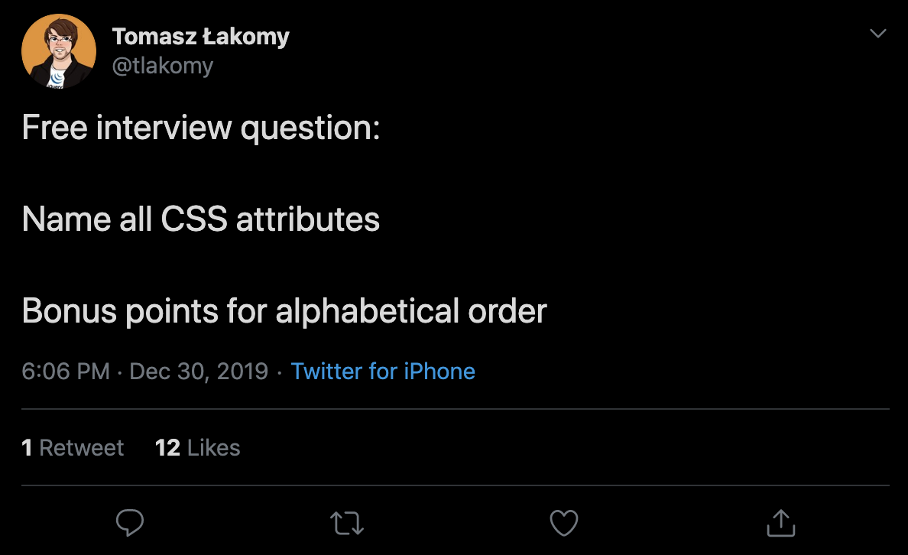

# `get-all-css-properties`

[](https://twitter.com/tlakomy/status/1211695059055316994)

A little CLI to get all the CSS properties sorted alphabetically and display it in your terminal, or to do whatever you want.

## k but why

for the lulz

## Usage

If you want to like use it in your project (i dunno why), you can actually import it and use it like

```js
import { getAllCSSProperties } from "get-all-css-properties";

const sup = async () => {
  const allThePropertiesLOL = await getAllCSSProperties(); // returns an array of properties

  allThePropertiesLOL.forEach(doCoolStuff);
};
```

I legit just made this for fun but who knows

## One More Thing...

I legit love you everyone.

[Say hi?](https://twitter.com/tejaskumar_)
